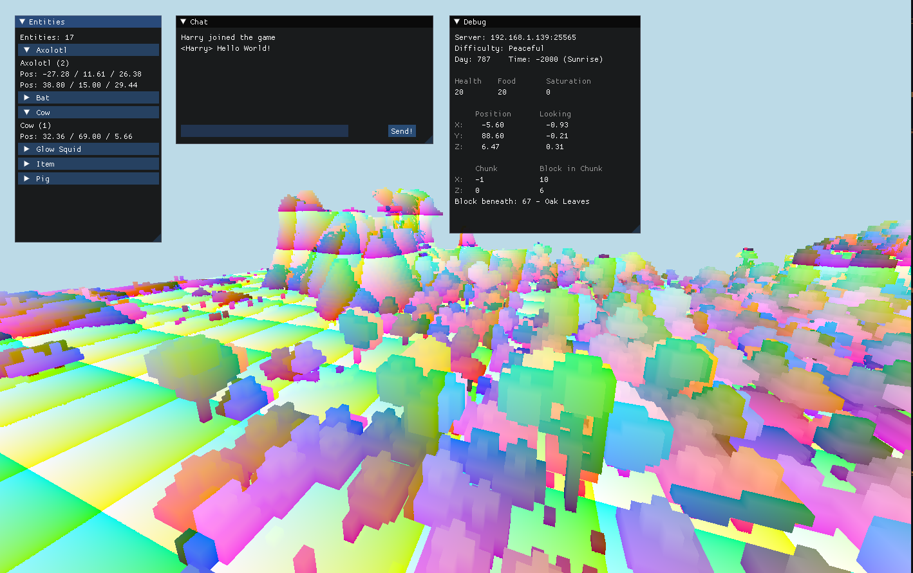
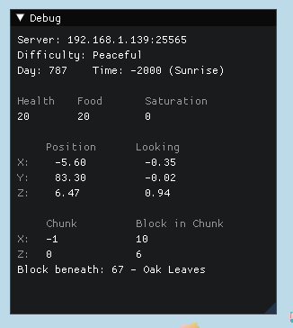
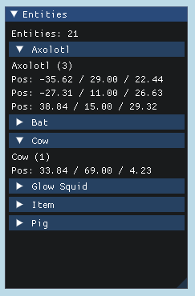
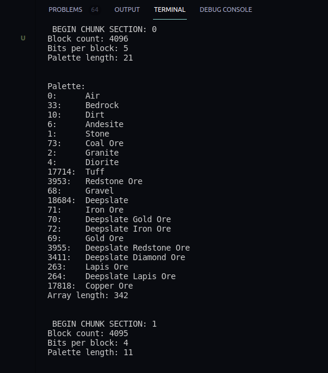
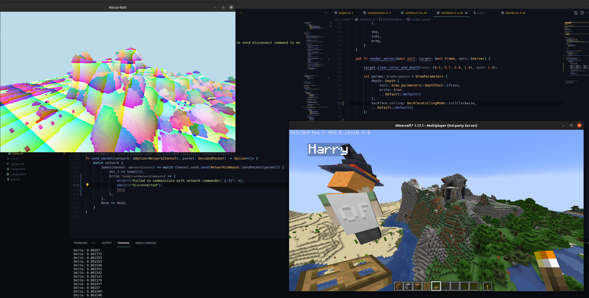

# mince-raft-rs

A Minecraft client in Rust that connects to real vanilla Minecraft servers.

I can only do this thanks to the extremely detailed documentation on the Minecraft Protocol at https://wiki.vg/Protocol

This is just a personal project to learn and practice, don't expect it to become useable as a replacement for the real Minecraft client.

# Building and Running

Import the git submodule with `git submodule init && git submodule update`\
The run the `get_assets.sh` script to download the required Minecraft assets and resources.\
Then the client should build without too much issue with Cargo.

Currently to run this client, you will just need to start a spigot server (1.17.1 probably) and turn off authentication (the setting might be called something like `online`?). It may also be a good idea to enable flying to prevent the client from getting kicked, as currently it doesn't have any physics or collisions.

After running the client, there is an area to input a server IP and connect.

# Current Features

The client currently only has some basic functionality:
* Connect to unsecured vanilla Minecraft servers

* Understand information about the server and the player

* Get nearby entities and their data

* Send and receive basic chat messages and execute commands on the server through chat

* Read Chunk Data and get the blocks making up the world

* Render a basic view of the chunks loaded

* Fly around in the world

# Credits

Font (minecraft_font.ttf) from [Here](https://fontmeme.com/fonts/minecraft-font/)